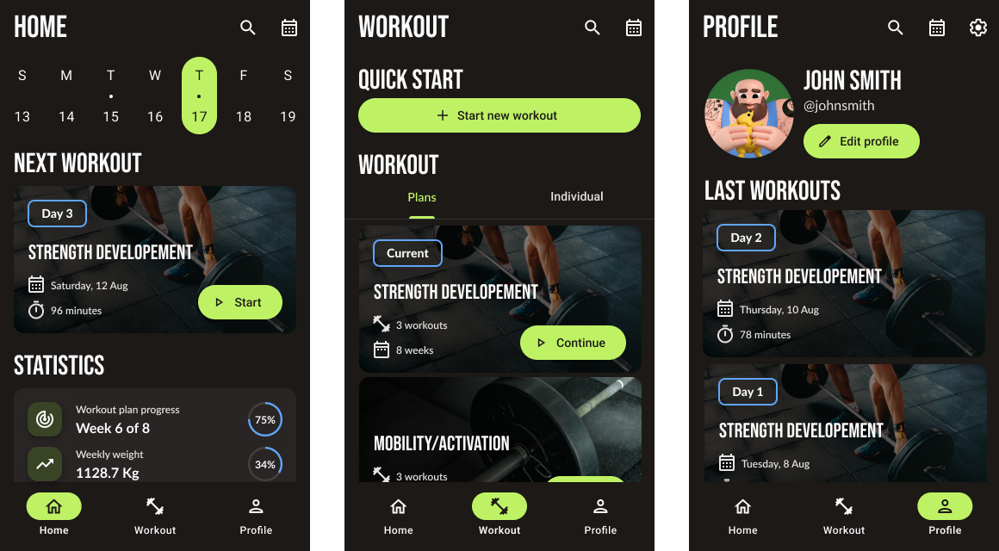
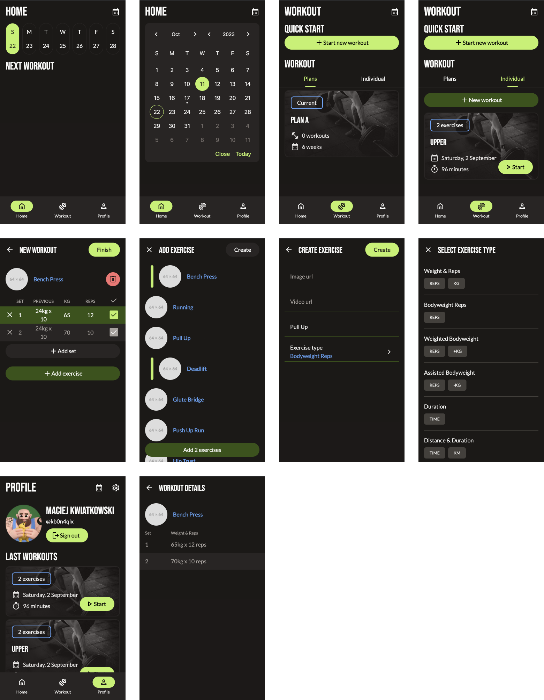

# Frontend Mentor - In-browser markdown editor solution

Weightly is a gym workout tracker app. I made it beacause none of the popular workout tracking app meet my needs.

## Table of contents

- [Overview](#overview)
  - [Design](#design)
  - [Screenshot](#screenshot)
  - [Links](#links)
- [My process](#my-process)
  - [Built with](#built-with)
  - [What I learned](#what-i-learned)

## Overview

### Design

The design I made using figma.

### Screenshot

Screenshots of the unfinished app.

### Links

- Live Site URL: [Weightly](https://weightly.vercel.app/home)

## My process

### Built with

- 
- 
- 
- 
- 
- Auth.js

### What I learned

This is my first app that I've made myself with Next.js, so with it I learned a lot about this React framework.
